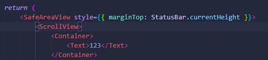
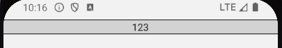
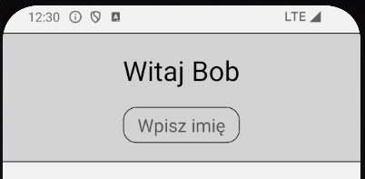
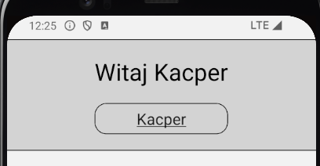
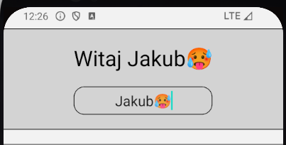
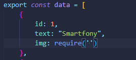
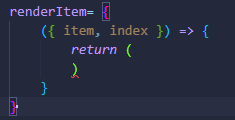
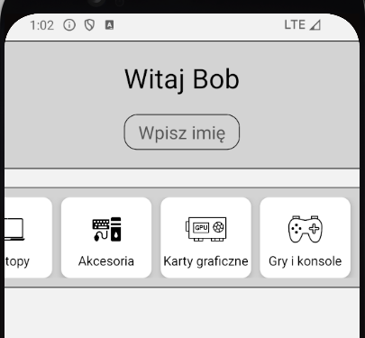

# Część teoretyczna
  Prezentcja do całego laboratorium znajduje się [tutaj](https://github.com/sikorski1/High-level-Programming-Languages-Project/raw/main/React_Native_od_zera_JPWP.odp)
Pomocne strony:
- React:
  - Wprowadzenie do Reacta - [Quick Start](https://react.dev/learn)
  - Dokumentacja - [React Reference Overview](https://react.dev/reference/react)
  - useState:
    - [State: A Component's Memory](https://react.dev/learn/state-a-components-memory)
    - [useState](https://react.dev/reference/react/useState)
- React Native:
  - Wprowadzenie do Reacta Native - [Introduction](https://reactnative.dev/docs/getting-started)
  - Hierarchia komponentów - [Thinking in React](https://react.dev/learn/thinking-in-react)
  - Różnice w komponentach - [RN Components](https://reactnative.dev/docs/intro-react-native-components)
  - Najważniejsze kompnenty - [Core Components](https://reactnative.dev/docs/components-and-apis)
  - RN API - [API](https://reactnative.dev/docs/accessibilityinfo)

# Część praktyczna

Przed rozpoczęciem pierwszego zadania poprawnie skonfiguruj środowisko, w tym celu zainstaluj [Node.js](https://nodejs.org/en) oraz [Expo](https://docs.expo.dev/get-started/installation/)
Komendy które będziesz często używał w Expo:
  -  `npx expo start` - uruchamia projekt
  -  `npx expo --tunnel` - jeśli nie można połączyć się ze swom telefonem (należy zatrzymać projekt i uruchomić go z tą komendą)
  -  kiedy wyskakują błędy w Expo [link](https://sebhastian.com/npm-err-enoent/)

## Zadanie 1

- Stwórz plik o nazwie `Container.js`
  - Zaimportuj [`View`](https://reactnative.dev/docs/view), [`StyleSheet`](https://reactnative.dev/docs/stylesheet) z `'react-native'`
  - Stwórz funkcję, która będzie zwracać kontener, skorzystaj z `View`
  - Dodaj podkreślenia na górze i na dole kontenera, tak aby wyodrębić jego treść
  - Ostyluj kontener i podkreślenia
  - Skorzystaj z właściwości, aby umożliwić umieszczenie komponentu w kontenerze

- Zaimportuj do pliku głównego `App.js`: `Container`, [`SafeAreaView`](https://reactnative.dev/docs/safeareaview), [`ScrollView`](https://reactnative.dev/docs/scrollview), [`StatusBar`](https://reactnative.dev/docs/statusbar), [`Text`](https://reactnative.dev/docs/text)
  - Struktura  `App.js`: `SafeAreaView` (odpowiednio ustaw komponent tzn. aby teść nie nachodziła na statusbar, dodając `marginTop: StatusBar.currentHeight`) > `ScrollView` > `Container` > (żeby sprawdzić czy nasze modyfikacje są poprawne umieść w kontenerze `<Text>123</Text>`):

-  Przykładowy wygląd:

## Zadanie 2

- Stwórz plik o nazwie `FirstComponent.js`
  - Zaimportuj `View`, `Text`, [`TextInput`](https://reactnative.dev/docs/textinput), `StyleSheet` z 
  - Zaimportuj [`useState`](https://react.dev/reference/react/useState)
- Stwórz komponent, który będzie wypełniać komponent `Text`, tekstem wpisanym do `TextInput`
  - Wykorzystaj `useState` oraz właściwości `TextInput`
  - Dodaj style do komponent
- Zaimprotuj komponent do pliku `App.js` 
  - Umieść zaimportowany komponent w kontenerze 
- Przykładowy wygląd

  

## Zadanie 3

- Stwórz plik o nazwie `SecondComponent.js `
- Stwórz plik `data.js`, który wypełnisz danymi potrzebnymi do wypełnienia kart:
  - `id`, `text`, `img`, zdjęcia pobierz z plików: `icon1`, `icon2`, ...

- Zaimportuj `View`, `Text`, [`FlatList`](https://reactnative.dev/docs/flatlist), [`Image`](https://reactnative.dev/docs/image), `data` do `SecondComponent.js`
  - Stwórz `View` (flex:1) > `FlatList`, do której przekażesz dane, usuniesz scrolla oraz ustawisz widok horyzontalny 
  - Za pomoca właściwości renderItem wygeneruj 5 kart korzystając z danych 
Struktura:

  - Ostyluj karty, dodaj `marginLeft` dla każdej karty z wyłączeniem ostatniej. Dla ostatniej dodaj `marginRight` (skorzystaj z `index` oraz `id`, użyj stylowania liniowego) 
- Zaimprotuj komponent do pliku `App.js `
  - Umieść zaimportowany komponent w kontenerze 
- Przykładowy wygląd:

 

## Zadanie 4

- Teraz zrobimy przejście do nowej strony
  - pobierz plik `dummyData.js`, w którym znajdują się informacje na temat przedmiotów, które bedą pojawiały się po kliknięcu w ikonkę kategorii
  - WIP

