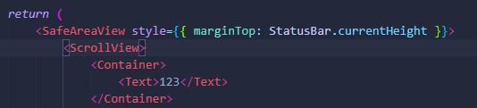
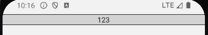
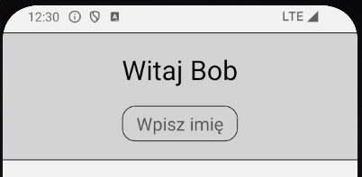
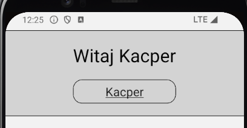
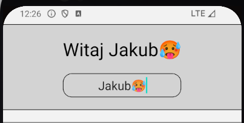
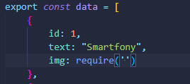
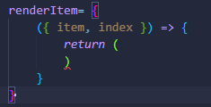
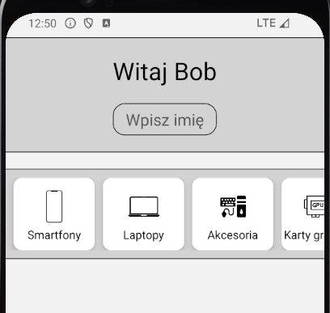

Zadanie 1
> a) Stwórz plik o nazwie Container.js   
> b) Zaimportuj View, StyleSheet   
> c) Stwórz funkcję, która będzie zwracać kontener, skorzystaj z View   
> d) Dodaj podkreślenia na górze i na dole kontenera, tak aby wyodrębić jego treść   
> e) Oscyluj kontener oraz podreślenia   
> f) Skorzystaj z props, aby umożliwić umieszczenie komponentu w kontenerze   
> g) Zaimportuj do pliku głównego App.js - Container, SafeAreaView, ScrollView, StatusBar, Text   
> h) Struktura  App.js: SafeAreaView (oscyluj liniowo, dodając marginTop: StatusBar.currentHeight) > ScrollView > Container > (dla testu umieść w kontenerze <Text>123</Text>)    
>    
>Przykładowy wygląd    
>    

Zadanie 2
> a) Stwórz plik o nazwie FirstComponent.js   
> b) Zaimportuj View, Text, TextInput, StyleSheet   
> c) Zaimportuj useState   
> d) Stwórz komponent, który będzie wypełniać <Text>, tekstem wpisanym do <TextInput>   
> e) Wykorzystaj useState oraz właściwości TextInput   
> f) Oscyluj komponent   
> g) Zaimprotuj komponent do pliku App.js   
> h) Umieść zaimportowany komponent w kontenerze   
> Przykładowy wygląd    
> 
> 
>     

Zadanie 3
> a) Stwórz plik o nazwie SecondComponent.js   
> b) Stwórz plik data.js, który wypełnisz danymi potrzebnymi do wypełnienia kart (id, text, img), zdjęcia pobierz z plików (icon1, icon2, ...)    
>     
> c) Zaimportuj View, Text, FlatList, Image, data do SecondComponent   
> d) Stwórz View(flex:1) > FlatListę, do której przekażesz dane   
> e) Za pomoca właściwości renderItem wygeneruj 5 kart korzystając z danych   
> f) Struktura    
>     
> g) Oscyluj karty   
> h) Zaimprotuj komponent do pliku App.js   
> i) Umieść zaimportowany komponent w kontenerze   
> Przykładowy wygląd    
> 

